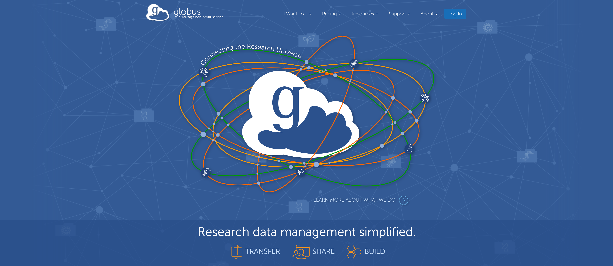

# How to set up Globus for files transfer



Globus website

Globus is a service for research data management. It can:

- **Transfer files**
- Share files with others
- Develop applications and gateways

My main usage is to transfer files, so I will focus on how to use Globus for transferring data.

### Endpoint

An “endpoint” is one of the two file transfer location - either the source or the destination. 

There are two types of endpoints: a personal endpoint and managed public endpoint.

The personal endpoint is usually your own desktop or laptop. You can create multiple personal endpoints for free. Managed endpoint is under subscription. 

### Subscription

](../images/2022-01-27-How-to-set-up-Globus/Untitled%201.png)

[https://www.globus.org/subscriptions#transfer-level](https://www.globus.org/subscriptions#transfer-level)

Without any subscription (Basic), file transfer from at least one managed endpoint and the other personal endpoint is free. For example, if you use XSEDE (managed endpoint), you can transfer any data from XSDEDE to your personal computer (personal endpoint), and vice versa, but you can not transfer data between two personal endpoints.

## Add Globus endpoint

To start data transfer, you need to add your machine as an endpoint. 

After log in, go to the ENDPOINTS section and click Create a personal endpoint.


You can download Globus Connect Personal.


After the installation, you can add additional drive to the Globus. By default, it only adds your home directory.

### Windows

If you use windows machine, you can simply click ‘+’ and add the path.


### Linux (no GUI)

For linux, you can the path into the config-paths.

```bash
# Add a directory path in:
vi ~/.globusonline/lta/config-paths

# Start running globus in background
./globusconnectpersonal -start &
```

## Data Transfer

Once the Globus is running in your local machine, you should be able to find your endpoint from the Globus website.


To start data transfer, go to FILE MANAGER and select two endpoints. If you have no subscription, at least one end point has to be managed endpoint. 


Select the folder you want to transfer from one endpoint (B2 in the image) and the path you want to store the data (XSEDE TACC stampede2). 


You can also set some options, such as preserve source file modification times. You can click Start to initiate transfer. Progress can be tracked in the ACTIVITY section.

You will receive an email if transfer is complete. 

## Transfer data between two personal endpoints

If your organization subscribe the Globus, you can request a membership through your organization.

[https://app.globus.org/groups/de2480c8-3c7c-11e5-8915-22000aeb2621/join](https://app.globus.org/groups/de2480c8-3c7c-11e5-8915-22000aeb2621/join)

Then, you should be able to transfer data between two local machines.